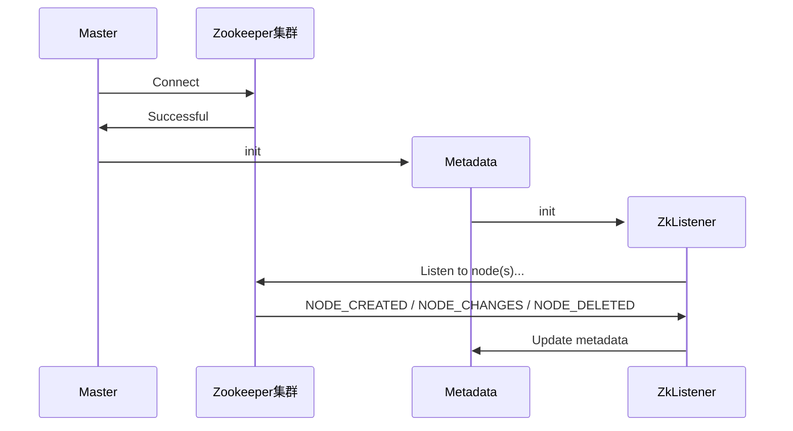
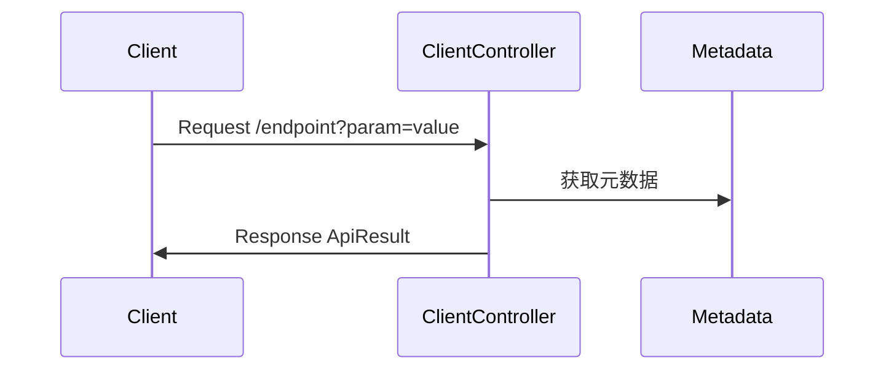

# 模块设计与测试报告

## 目录

[TOC]

## 系统总体介绍

### 项目背景

本项目是一个分布式 MiniSQL 系统，属于《大规模信息系统构建技术导论》的课程项目。本项目包含 Client、Master Server、Region Server 和 Zookeeper 共四个模块，实现一个在多主机上共享数据资源访问的分布式数据库系统，还实现了前端网页界面，能够对简单 SQL 语句进行处理和解析，实现了基本分布式数据库的功能，包括容错容灾、负载均衡、副本管理等。

### 系统目标

本项目开发针对分布式数据库的特点设计了以下具体功能目标，

- 分布式查询
- 副本管理
- 负载均衡
- 数据分布和集群管理
- 容错容灾

## 个人工作介绍

TODO

### 整体架构与技术选型

我们小组开发的分布式数据库由下图所示，包含了Master Server, Region Server, Client, Zookeeper 四个模块。其中：

- Master Server负责了全局的管理与任务调度，并维护了数据库的元信息，为Client提供路由服务，并实现了负载均衡
- Region Server负责了数据的存储和实际请求处理，实现了副本管理，基于临时节点的心跳机制，容错容灾和副本管理，以及配合Master实现了负载均衡
- Client: 负责与分布式数据库进行交互，实现了较为友好的用户界面
- Zookeeper：提供消息订阅与通知服务，以实现分布式协调和故障检测


### Master Server 架构

### Master Server 流程

#### Master与Zookeeper集群的交互流程




#### Client与Master的交互



#### 热点问题的负载均衡流程

```	
1. 利用Metadata，遍历所有Region的元数据
2. 如果Region是上线的（代表可写）
3. 从中选取被访问次数最多和最少的Region
4. 如果上线Region>=2且MaxVisitedRegion的次数>=2*MinVisitedRegion的次数且MaxVisitedRegion的次数>HOTPOINT_THRESHOLD
5. 执行数据迁移，将MaxVisitedRegion一半的数据迁移至MinVisitedRegion
6. 重置所有Region的访问次数
```

### 子模块设计

Master Server主要可以分为几个子模块分别是：对Client开放的接口模块、与Zookeeper集群交互的模块和热点问题的负载均衡实现模块。

### 核心功能设计与实现

## 功能测试

编写了一个`MasterTest.py`的测试脚本，用于快速测试及观察请求的返回结果。
