# 模块设计与测试报告

## 目录

[TOC]

## 系统总体介绍

### 项目背景

本项目是一个分布式 MiniSQL 系统，属于《大规模信息系统构建技术导论》的课程项目。本项目包含 Client、Master Server、Region Server 和 Zookeeper 共四个模块，实现一个在多主机上共享数据资源访问的分布式数据库系统，还实现了前端网页界面，能够对简单 SQL 语句进行处理和解析，实现了基本分布式数据库的功能，包括容错容灾、负载均衡、副本管理等。

### 系统目标

本项目开发针对分布式数据库的特点设计了以下具体功能目标，

- 分布式查询
- 副本管理
- 负载均衡
- 数据分布和集群管理
- 容错容灾

## 个人工作介绍

在本项目中，本人负责了对Master的架构设计和编码实现与测试，以及撰写Master服务器相关的开发文档及报告。同时利用开发工具如Docker和Git进行系统测试和生产部署等。

### 整体架构与技术选型

我们小组开发的分布式数据库由下图所示，包含了Master Server, Region Server, Client, Zookeeper 四个模块。其中：

- Master Server负责了全局的管理与任务调度，并维护了数据库的元信息，为Client提供路由服务，并实现了负载均衡
- Region Server负责了数据的存储和实际请求处理，实现了副本管理，基于临时节点的心跳机制，容错容灾和副本管理，以及配合Master实现了负载均衡
- Client: 负责与分布式数据库进行交互，实现了较为友好的用户界面
- Zookeeper：提供消息订阅与通知服务，以实现分布式协调和故障检测

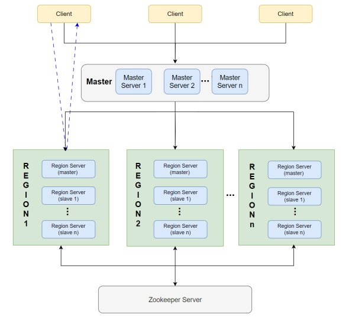

### Master Server 架构

为了实现分布式数据库高可用、一致性、数据分区等分布式系统的性质，针对以下几点功能设计Master服务器，其中包括数据分布、集群管理、副本管理及容错容灾、分布式查询和负载均衡。Master Server的架构如下图：

#### 数据分布

为了实现数据分布，采用了基于哈希的数据分区策略，即会根据插入数据的主键哈希值，将数据尽量均匀的分布在不同的Region上，以此来实现一定的负载均衡。但由于当前数据可能分布在多个Region上，所以Client向Master发送查询请求后，Master的返回结果是存有被查询的表所属的Region复杂处理查询操作的Slave主机，同时Master必须确保返回的Slave是可用的。因此Client需要向多个Region发送查询请求。

#### 集群管理

为了保证与Zookeeper集群连接的可靠性，会使用Zookeeper集群，而在Master Server会预先用一个数组存储Zookeeper集群里所有的服务器的IPv4地址，这样可以保证如果其中的Zookeeper出现故障或连接不上，可以尝试连接其余的Zookeeper服务器。

#### 分布式查询

由于同个表的数据是根据表的主键哈希值分布在不同Region上的，所以Client在发送查询请求到Master后，Master会返回一个或多个来自不同Region负责处理查询操作的Slave。

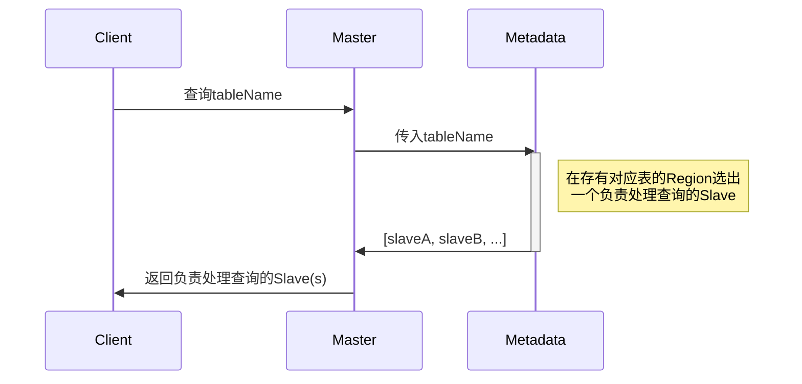


#### 副本管理/容错容灾

为了实现容错容灾，提升Master服务器的可用性，采用了主从副本管理方法。多个Master中，每个Master维护的元数据都是一致的，而主Master会负责热点问题的负载均衡策略调度，其余的从节点Master是主Master的副本，但不会进行热点检测和数据迁移的负载均衡策略，仅会对来自Client的请求进行对应的操作。

#### 负载均衡

Master 的核心功能是负载均衡（Load Balancing），Master会尽可能将数据和请求都均匀地分布在每个Region上。

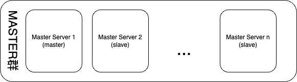

### Master Server 流程

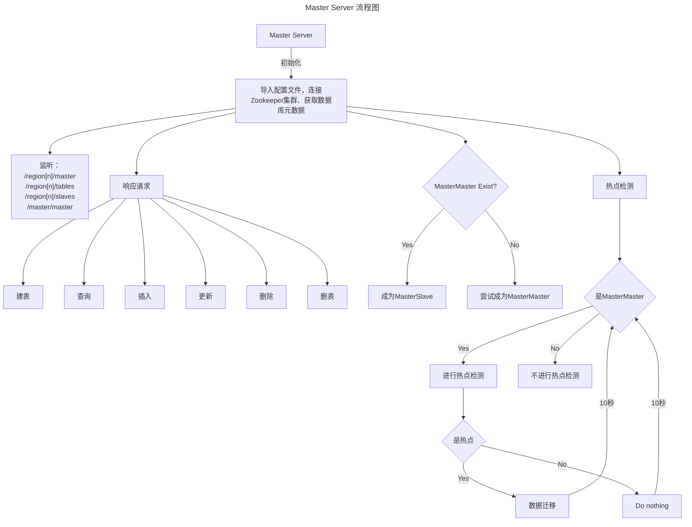


#### Master与Zookeeper集群的交互流程

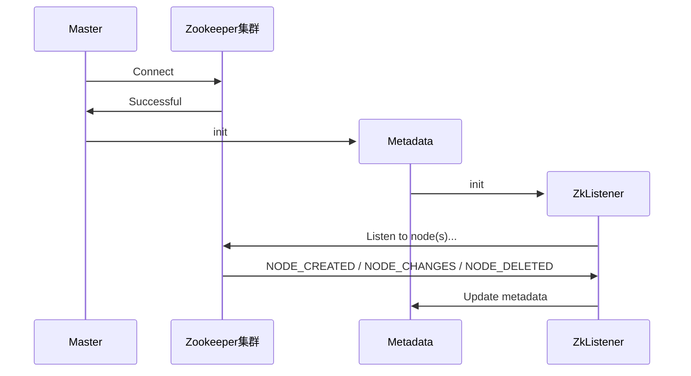


#### Client与Master的交互

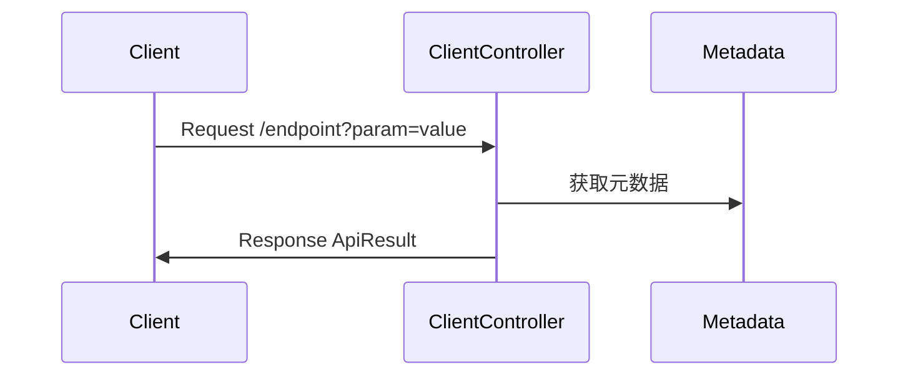

#### 热点问题的负载均衡流程

```	
1. 利用Metadata，遍历所有Region的元数据
2. 如果Region是上线的（代表可写）
3. 从中选取被访问次数最多和最少的Region
4. 如果上线Region>=2且MaxVisitedRegion的次数>=2*MinVisitedRegion的次数且MaxVisitedRegion的次数>HOTPOINT_THRESHOLD
5. 执行数据迁移，将MaxVisitedRegion一半的数据迁移至MinVisitedRegion
6. 重置所有Region的访问次数
```

### 子模块设计与实现

Master Server主要可以分为几个子模块分别是：对Client开放的接口模块、与Zookeeper集群交互的模块、元数据管理模块和热点问题的负载均衡实现模块。

#### 对Client开放的接口模块

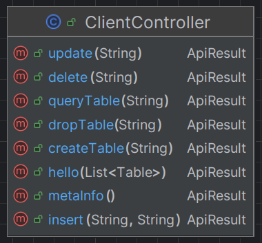

对Client开放的接口主要有以下：

1. `/create_table` 返回负责建表的master
2. `/query_table` 返回负责处理查询的slave(s)
3. `/drop_table` 返回负责处理删表的master(s)
4. `/update` 返回负责处理修改表的master(s)
5. `/insert` 返回负责处理插入表的master
6. `/delete` 返回负责删除记录的master(s)

#### 与Zookeeper集群交互的模块

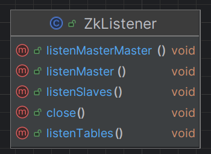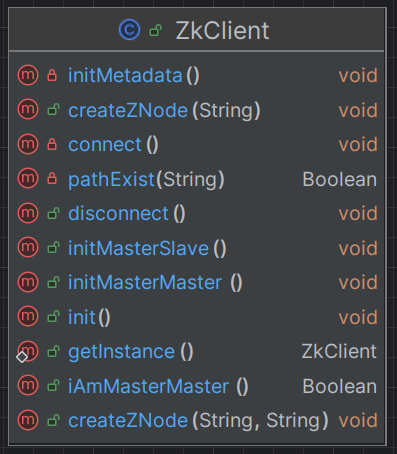

与Zookeeper集群交互的类如上图两个，分别是`ZkListener`和`ZkClient`。其中`ZkListener`在`ZkClient`中实例化。接下来一一说明重点的方法：

1. `listenMasterMaster()`是用于监听`/master/master`路径，判断是否成为主Master或从Master，`listenMaster()`、`listenSlaves()`、`listenTables()`则是用于监听Region所对应的路径节点变化，动态维护Region的元数据。
2. `init()`方法的内部执行顺序是先`connect()`后`initMetadata()`，`connect()`是连接Zookeeper集群的方法，`initMetadata()`是从Zookeeper集群中获取元数据并在Metadata中初始化。

#### 元数据管理模块

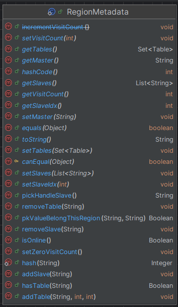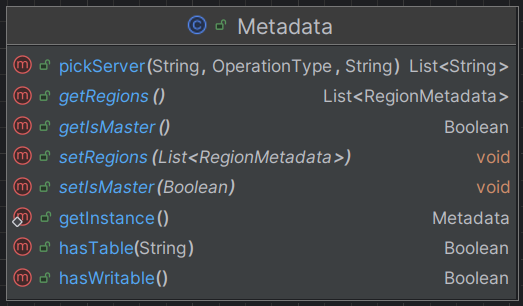

元数据的管理由以上这两个类负责。首先，Metadata是负责全局的元数据，也就是整个分布式数据库的元数据都存储在Metadata类。Metadata采用的设计模式是Singleton，这样可以保证一个Master服务器在读写元数据的时候都是使用同一个实例。在Metadata里用了一个类RegionMetadata数组来存储所有Region对应的元数据。接下来将说明一些比较重要的方法。

1. `isOnline()`实现的是如果Region的master是活跃的，那此Region就是上线的，否则下线。
2. `pickHandleSlave()`实现的是轮询一个Region里的所有Slave，比如这一次查询选择了`slave[i]`下一次就会选择`slave[(i+1)%slaves.length]`。
3. `pkValueBelongThisRegion(String, String)`实现的是遍历Region的所有table元数据，判断这个主键值`pkValue`是否属于这个Region。
4. `pickServer(String, OperationType, String)`实现的是遍历所有Region，根据数据库的操作类型，做出对应的判断与检查，选择并返回合适的服务器。
5. `hasWritable()`遍历所有Region的元数据，如果有上线的Region就返回真，如果没有Region是上线则没有可写的Region。

#### 热点问题的负载均衡实现模块

透过`@Scheduled`注解实现每间隔10秒发布一次热点检测，热点检测及相应数据迁移策略的详细流程如下：

1.   如果当前`master`是主节点，则进行热点检测，否则不进行热点检测（这么设计的原因是保证Master群里只有一个Master会下达数据迁移的命令）
2.   遍历每个Region，选出**可写**且访问次数<u>最多</u>和<u>最少</u>的Region，其中MinVisitedRegion不能存有MaxVisitedRegion里存有的表，否则没法重新分区。
3.   如果满足热点迁移的条件（条件为上线Region>=2且MaxVisitedRegion的次数>=2*MinVisitedRegion的次数且MaxVisitedRegion的次数>HOTPOINT_THRESHOLD），进行数据迁移。
4.   数据迁移的流程是，首先对Region的表主键哈希值区间重新分配，规则如下：
     1.   假设table的主键哈希值区间是`[start, end)`，分配后`mid=(start+end)/2`存在MaxVisitedRegion的table哈希值区间是`[start,mid)`，MinVisitedRegion的table哈希值区间是`[mid,end)`
     2.   如果`end - start <= 1`，没必要重新分布数据，因为哈希值区间已经没法再分割了。
5.   将分区好的数据区间透过POST请求`/hotsend`接口到对应的Region。
6.   Region则会根据Master下达的指令对Region的数据进行迁移。
7.   完成数据迁移后，Region会自动对Zookeeper的元数据进行更新及持久化。

## 功能测试

编写了一个`MasterTest.py`的测试脚本，用于快速测试及观察请求的返回结果。
